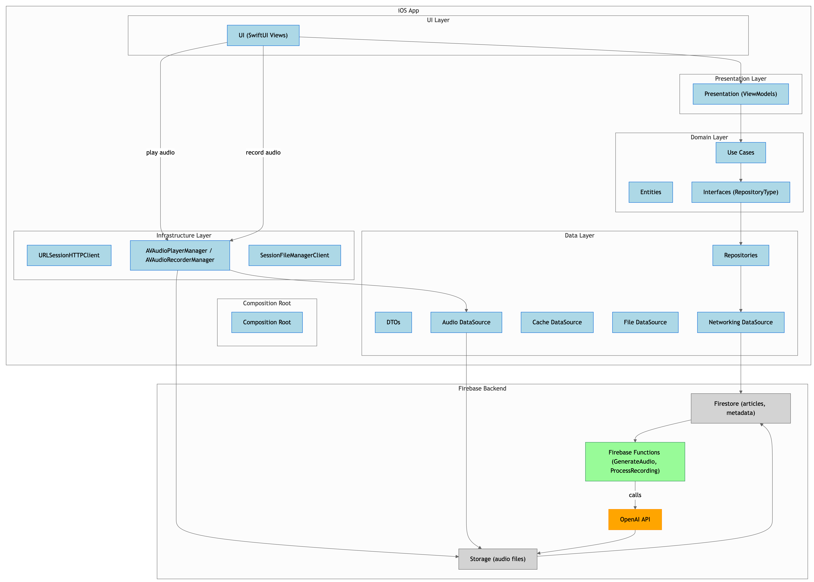

# Daily Lingua iOS App

## Overview
Daily Lingua is an iOS application that helps users practice language skills through daily exercises.  
The project follows a **clean architecture** approach and includes both the iOS app and a backend built with Firebase Functions.

## Architecture
The project is divided into several layers:

- **Domain**  
  Contains entities and use cases that represent the core business logic.  

- **Data**  
  Responsible for managing data sources such as local storage or network services.  

- **Infrastructure**  
  Handles frameworks and services like AVFoundation, networking, or audio recording.  

- **Presentation**  
  Contains ViewModels that handle the logic for views and coordinate with the domain layer.  

- **UI**  
  SwiftUI Views that display content to the user and interact with ViewModels.

Diagram:

## Backend
The backend is built with **Python** using **Firebase** and handles several key responsibilities:

- **Firestore**  
  Stores articles.  

- **Storage**  
  Stores generated audio files for articles and user responses.  

- **Firebase Functions**  
  - Consume the **OpenAI API** to generate audio files for articles stored in Firestore.  
  - Store generated audio in Firebase Storage.  
  - Trigger processing of user response recordings *(currently in progress)*.  
  - Generate reports based on processed audio in future releases *(currently in progress)*.

- **Secrets Management**  
  API keys and sensitive information are stored securely using Firebase Secrets.

This architecture allows the app to fetch articles, play AI-generated audio, record user responses, and prepare for future analysis and reporting.

## Current state of development
 - Loading and playing the audio of the completed articles
